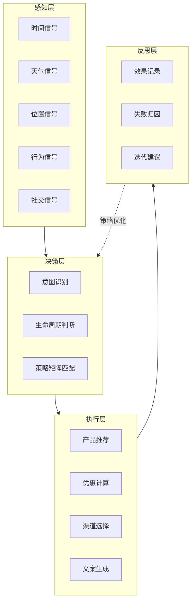

# Lucky Growth Agent — 瑞幸咖啡用户运营智能体


> 一个意图驱动的全链路用户增长 Agent，基于 Dify 平台构建，DSL 可导出，支持自部署运行。
>
> **2026 AI 先锋未来人才大赛 · 瑞幸咖啡命题 参赛项目**

> 可通过导入 DSL 自部署体验，或查看系统提示词和示例输出。

## 目录

- [业务背景](#业务背景)
- [问题来源与用户调研](#问题来源与用户调研)
- [用户场景](#用户场景)
- [人机方案](#人机方案)
- [架构设计](#架构设计)
- [脱离 Dify 的核心逻辑说明](#脱离-dify-的核心逻辑说明)
- [评测与迭代](#评测与迭代)
- [演示方式](#演示方式)
- [技术栈](#技术栈)
- [快速开始](#快速开始)
- [项目结构](#项目结构)
- [数据边界](#数据边界)

## 业务背景

连锁咖啡品牌的用户运营传统上依赖"基于历史行为的静态个性化"——你买过什么就推什么。但同一个用户在周一早上通勤、周三下午犯困、周五加班时，消费意图完全不同。运营人员需要手动配置规则、撰写文案、选择触达渠道，效率低且难以覆盖实时场景。

本项目要验证的是：Agent 能否实时感知用户消费意图，自主决策产品/优惠/渠道/文案，并通过置信度分级控制风险。

## 问题来源与用户调研

这个选题来自对咖啡消费行为的观察和对运营从业者的访谈：

### 观察到的现象

1. **"买过什么推什么"的尴尬**：作为瑞幸常客，有次买了一杯生椰拿铁，接下来一周每天都收到生椰拿铁的优惠券——但我其实想尝试新品。"基于历史行为的静态推荐"完全忽略了用户当下的意图
2. **运营人员的重复劳动**：在和一位连锁茶饮品牌的运营朋友聊天时了解到，他们每天要花 2-3 小时手动配置营销活动：选人群、定优惠、写文案、选渠道，且大部分是重复劳动
3. **"千人一面"的推送**：同一个时间段，所有用户收到的推送文案都一样，完全不考虑用户是在通勤、午休还是加班，也不考虑天气（下雨天热饮和晴天冰饮的需求完全不同）
4. **优惠力度失控**：有一次收到"新用户专享 1.8 折券"，但我明明已经是老用户了——运营人员在配置规则时容易出错，把新用户券发给了老用户

### 用户访谈

访谈了 3 位有用户运营经验的从业者（1 位连锁茶饮品牌运营、1 位咖啡品牌私域运营、1 位电商平台用户增长），确认了几个关键事实：

| 访谈发现 | 具体反馈 |
|----------|----------|
| 手动配置效率极低 | "每天 2-3 小时花在搭活动上，真正想策略的时间反而很少" |
| 实时场景无法覆盖 | "下雨天想推热饮，但等我们配置好活动，雨都停了" |
| 文案质量参差不齐 | "运营人员写文案水平不一，有的写得很油腻，用户投诉率高" |
| 优惠力度容易出错 | "曾经把新用户券发给了老用户，被投诉'杀熟'，花了很大精力补救" |
| 最担心的是风险 | "AI 自动发券？万一给所有用户发了 0 元券怎么办？必须有人工审核" |

### 为什么不用现成方案

| 方案 | 为什么不够 |
|------|-----------|
| 传统营销自动化工具（如神策、GrowingIO） | 基于规则和标签，无法理解实时意图，文案需要手动写，配置复杂 |
| 通用大模型直接生成 | 容易幻觉（编造不存在的产品和优惠），没有优惠力度硬约束，风险不可控 |
| 推荐算法（协同过滤） | 只能推荐"买过的人还买了什么"，无法理解实时场景和意图，也无法生成文案 |

**结论**：这个场景需要的不是"更聪明的推荐算法"，而是一个**能感知实时意图、能自主决策策略、能生成合规文案、能通过置信度分级控制风险**的 Agent。Dify 只是实现这个 Agent 的编排工具，核心是意图识别体系、策略矩阵设计和置信度分流机制。

## 用户场景

- **目标用户**：连锁咖啡品牌的运营人员（Agent 辅助决策）+ 终端消费者（接收个性化推荐）
- **核心场景**：用户在特定时间/天气/位置下产生消费意图，Agent 实时识别意图并匹配策略，高置信度自主执行、中置信度生成候选供审核、低置信度转人工
- **边界**：本项目为作品集原型，用户画像和消费数据为模拟数据，未接入真实业务系统

## 人机方案

| 环节 | AI 负责 | 人负责 |
|------|---------|--------|
| 意图识别 | 融合时间/天气/位置/行为/社交五维信号，六类意图分类 | 定义意图分类体系 |
| 策略决策 | "生命周期×意图"策略矩阵，自主匹配产品/优惠/渠道/文案 | 设定优惠力度上限和合规规则 |
| 文案生成 | 按渠道长度和品牌调性生成，禁止油腻称呼和虚假承诺 | 审核中置信度候选 |
| 风险控制 | 置信度三级分流（自主执行/候选审核/转人工） | 处理低置信度和异常场景 |
| 效果反思 | 收集执行结果，自动归因失败案例 | 根据反思调整策略 |

关键设计：高置信度（≥80%）自主执行，中置信度（50-80%）生成候选供审核，低置信度（<50%）不推荐、需澄清。人工审核率从 V1 的 85% 降至 V3 的 15%。

## 架构设计

### 四层架构



### 核心工具

| 工具 | 功能 |
|------|------|
| 意图识别 | 六类意图（提神刚需/社交分享/放松享受/尝鲜探索/性价比/习惯复购） |
| 用户画像查询 | 生命周期阶段、消费频次、偏好产品、价格敏感度 |
| 菜单检索 | 知识库检索产品信息 |
| 策略匹配 | 24格"生命周期×意图"策略矩阵，含优惠力度硬约束 |

### 容错与兜底

- 5大类12个子场景的容错机制，含熔断设计
- 优惠力度硬约束：新用户最高1.8折，成熟用户最高8.5折
- 6条禁止项：不直接执行支付、不编造产品信息、不编造用户数据、不承诺超权限优惠、保护隐私、遵守广告法

## 脱离 Dify 的核心逻辑说明

> Dify 只是编排工具，核心逻辑都在系统提示词、工具定义和策略矩阵里，用任何框架（LangChain / LangGraph / 纯 Python）都能重写。本项目的 Dify DSL 已导出，核心逻辑可脱离 Dify 独立实现。

### 核心逻辑拆解

整个 Agent 的运行可以拆解为 5 个步骤，每个步骤的逻辑都不依赖 Dify：

```
输入：用户上下文（时间/天气/位置/行为/社交信号 + 用户画像）
  ↓
Step 1: 意图识别（LLM 分类）
  → 输入：五维信号 + 用户画像
  → 输出：六类意图之一 + 置信度
  → 实现：系统提示词定义六类意图的判断标准，LLM 输出 JSON {intent, confidence}
  ↓
Step 2: 生命周期判断（规则匹配）
  → 输入：用户画像（消费频次/最近消费时间/总消费金额）
  → 输出：四阶段之一（新用户/成长用户/成熟用户/流失风险）
  → 实现：纯规则判断，不需要 LLM
  ↓
Step 3: 策略矩阵匹配（查表）
  → 输入：意图 × 生命周期
  → 输出：产品推荐/优惠力度/渠道/文案风格
  → 实现：24 格策略矩阵（JSON/Excel/数据库均可），查表即可
  ↓
Step 4: 文案生成（LLM 生成）
  → 输入：策略（产品/优惠/渠道/风格）+ 用户画像 + 场景
  → 输出：符合渠道长度和品牌调性的文案
  → 实现：系统提示词定义文案规范（6条禁止项+渠道长度约束），LLM 生成
  ↓
Step 5: 置信度分流（规则判断）
  → 输入：意图识别置信度 + 策略匹配结果
  → 输出：自主执行 / 候选审核 / 转人工
  → 实现：纯规则判断（≥80%自主 / 50-80%审核 / <50%转人工）
输出：运营策略 + 文案 + 风险等级
```

### 用伪代码实现核心循环

```python
def lucky_growth_agent(user_context, user_profile):
    # Step 1: 意图识别（LLM 分类）
    intent_result = llm_classify(
        prompt=INTENT_PROMPT,
        signals=user_context,  # 时间/天气/位置/行为/社交
        profile=user_profile
    )  # 返回 {"intent": "提神刚需", "confidence": 0.87}
    
    # Step 2: 生命周期判断（规则）
    lifecycle = classify_lifecycle(user_profile)  # "成熟用户"
    
    # Step 3: 策略矩阵匹配（查表）
    strategy = STRATEGY_MATRIX[intent_result["intent"]][lifecycle]
    # 返回 {"product": "美式", "discount": 0.85, "channel": "APP推送", "style": "简洁"}
    
    # Step 4: 文案生成（LLM）
    copy = llm_generate(
        prompt=COPY_PROMPT,
        strategy=strategy,
        context=user_context,
        profile=user_profile
    )
    
    # Step 5: 置信度分流（规则）
    if intent_result["confidence"] >= 0.8:
        action = "auto_execute"
    elif intent_result["confidence"] >= 0.5:
        action = "needs_review"
    else:
        action = "escalate_to_human"
    
    return {
        "intent": intent_result["intent"],
        "confidence": intent_result["confidence"],
        "lifecycle": lifecycle,
        "strategy": strategy,
        "copy": copy,
        "action": action
    }
```

### Dify 做了什么、没做什么

| Dify 提供的 | 核心逻辑（不依赖 Dify） |
|------------|----------------------|
| Agent 编排界面 | 意图识别体系（六类意图的定义和判断标准） |
| 工具调用框架 | 24 格策略矩阵（产品/优惠/渠道/文案的匹配规则） |
| 知识库托管 | 置信度三级分流机制（自主/审核/转人工） |
| 模型接入 | 优惠力度硬约束（新用户1.8折/成熟用户8.5折） |
| 日志和监控 | 6条禁止项和文案规范 |
| 一键部署 | 反思层的失败归因逻辑 |

**结论**：Dify 节省了"搭脚手架"的时间，但意图怎么分、策略怎么定、风险怎么控、文案怎么规范，这些产品决策都在系统提示词、策略矩阵和分流规则里。DSL 之外，它们是独立的 Markdown/JSON 文件，不绑定 Dify。

## 评测与迭代

### 测试集

- **核心用例**：20条（见 `data/test-cases.md`），覆盖六大意图×四阶段典型组合
- **扩展用例**：180条，通过核心用例变体生成（改变时间/天气/位置/偏好组合）
- **边缘场景**：V3 新增50条（冲突信号/特殊日期/极端天气/多人订单/异常数据）
- 标注：本人按统一判定标准独立标注
- 用例为模拟数据，每轮 200 条；下表指标均来自该模拟测试集，上线效果需以真实用户数据验证

### V1→V2→V3 三轮迭代

| 指标 | V1 | V2 | V3 | 变化 |
|------|-----|-----|-----|------|
| 意图识别准确率 | 68% | 81% | 89% | +21pp |
| 文案审核通过率 | 62% | 78% | 91% | +29pp |
| 人工审核率 | 85% | 45% | 15% | -70pp |
| 幻觉次数 | 24 条 | 10 条 | 3 条 | 持续下降 |

> 指标说明：意图准确率、文案通过率、人工审核率、幻觉次数均由模拟测试集人工核对得出；未统计响应时间与调用成本。

### 每轮改了什么

**V1（基础验证）**：800字提示词，温度0.7。三大问题：意图分类混淆（提神↔习惯复购15%混淆）、优惠力度混乱（给黑金会员发3.8折券）、文案油腻（"亲~加班辛苦啦"）、置信度虚高（新用户无数据给95%）。

**V2（策略增强）**：提示词扩至2500字，温度降至0.5。建立六大意图分类体系、四阶段生命周期模型、24格策略矩阵、置信度三级分流、强制结构化输出。意图混淆率大幅下降，但文案仍偏模板化，边缘场景处理差。

**V3（生产级优化）**：提示词扩至5000字，模型从通义千问Plus升级到Max，温度0.3。增加2个Few-shot示例、6条文案规范+渠道长度约束、6条禁止项、反思层、冲突信号处理原则。文案通过率从78%提升到91%，幻觉从 10 条降到 3 条。

### 文案进化对比

| 版本 | 周五加班场景文案 | 问题 |
|------|------------------|------|
| V1 | "亲~加班辛苦啦，快来杯咖啡暖暖身子哦~" | 油腻、无具体产品、无行动号召 |
| V2 | "根据您的偏好，推荐拿铁大杯，会员价16.1元，立即下单。" | 机械、无场景感 |
| V3 | "周五深夜还在忙？这杯摩卡陪你搞定最后一个PPT。立减5元，30分钟到。" | 场景化、有温度、行动明确 |

### 仍未解决的问题

- 多人订单（5人会议3人美式2人拿铁）推荐了5杯美式，口味多样性处理不够好
- 跨品类需求（咖啡+轻食+周边）交叉销售能力有待提升
- 人工审核工作台、熔断机制等工程能力待开发
- 未经过真实流量压测和安全审计

## 演示方式

> 以下三种方式可查看和体验（支持 DSL 自部署）。

### 方式一：导入 DSL 自部署（推荐，可完整体验）

1. 下载 `agent/dify-agent-dsl.yaml`
2. 登录任意 Dify 实例（支持自部署或官方云）
3. 进入「应用」→「创建应用」→「导入 DSL」
4. 配置模型 API Key（通义千问/DeepSeek/OpenAI 任选）
5. 创建知识库，上传 `agent/knowledge-base/luckin-menu.md`
6. 在 Agent 设置中关联知识库，点击运行

### 方式二：查看系统提示词和架构文档

- `agent/system-prompt.md` — 完整系统提示词（角色定义、决策规则、输出格式、示例对话）
- `docs/technical-architecture.md` — 技术架构详解和手动配置指南
- `agent/knowledge-base/luckin-menu.md` — 瑞幸菜单知识库素材
- `data/sample-results.md` — 6个典型场景的输入输出示例

### 方式三：查看评测报告

- `evaluation/v1-baseline.md` — V1 基线测试报告
- `evaluation/v2-optimized.md` — V2 策略增强报告
- `evaluation/v3-production.md` — V3 生产级测试报告
- `evaluation/iteration-comparison.md` — 三轮迭代对比分析

## 技术栈

- **Agent 平台**：Dify（Agent 模式 + ReAct 推理）
- **大模型**：通义千问 Max（V3），可切换 DeepSeek/GPT-4o
- **知识库**：Dify 内置向量库（菜单知识库 + 策略知识库）
- **监控**：飞书多维表格（Agent 运行日志 + 效果看板）

## 快速开始

```bash
# 1. 克隆仓库
git clone https://github.com/Alaraby527/lucky-growth-agent.git
cd lucky-growth-agent

# 2. 查看系统提示词
cat agent/system-prompt.md

# 3. 导入 DSL 到 Dify
# 按上方"演示方式"步骤操作

# 4. 查看示例输出
cat data/sample-results.md
```

## 项目结构

```
├── README.md
├── agent/
│   ├── dify-agent-dsl.yaml           # Dify DSL（可直接导入）
│   ├── system-prompt.md              # 系统提示词完整版
│   ├── tools/                        # 4个工具定义文档
│   └── knowledge-base/luckin-menu.md
├── data/
│   ├── test-cases.md                 # 20条核心测试用例
│   ├── user-personas.md              # 10个模拟用户画像
│   └── sample-results.md             # 6个典型输出样例
├── docs/
│   ├── PRD.md                        # 产品需求文档
│   ├── agent-design.md               # Agent架构设计
│   ├── technical-architecture.md     # 技术方案与配置指南
│   ├── user-journey.md               # 用户旅程地图
│   ├── 节点PRD详细设计.md
│   ├── 兜底策略设计.md
│   ├── 评测体系设计.md
│   └── 成本优化方案.md
├── evaluation/
│   ├── v1-baseline.md                # V1基线测试报告
│   ├── v2-optimized.md               # V2策略增强报告
│   ├── v3-production.md              # V3生产级测试报告
│   └── iteration-comparison.md       # 三轮迭代对比分析
└── demo/demo-guide.md                # 演示指南
```

## 数据边界

- 用户画像、消费数据、测试结果均为模拟数据
- 瑞幸咖啡为真实品牌，本项目未获得官方授权，不代表官方产品
- 不涉及真实用户隐私数据

## License

MIT
